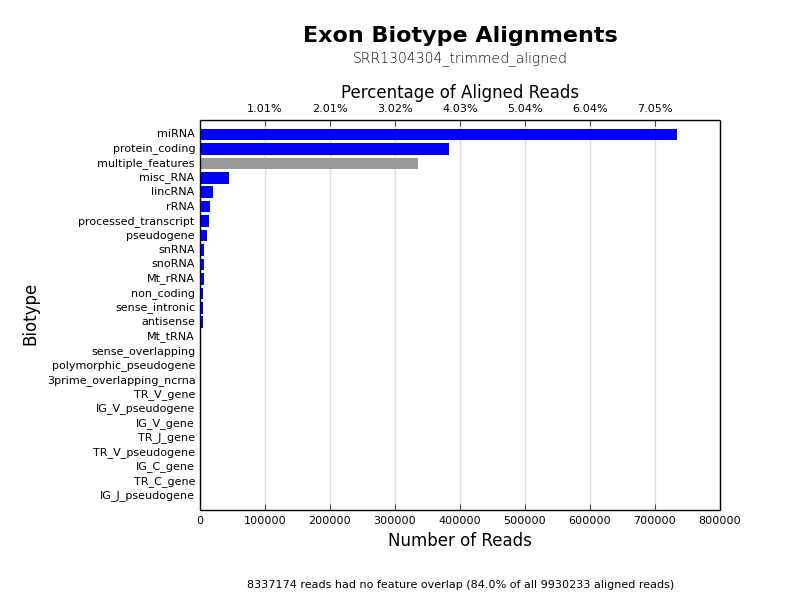
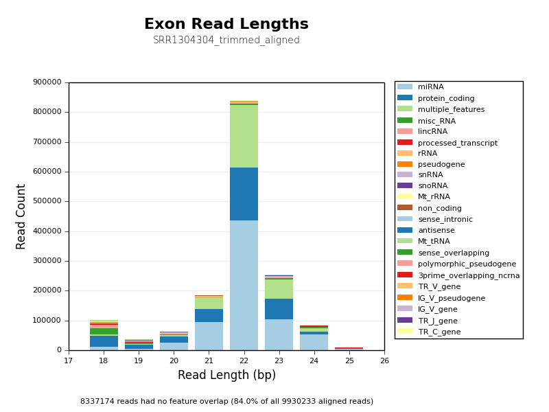
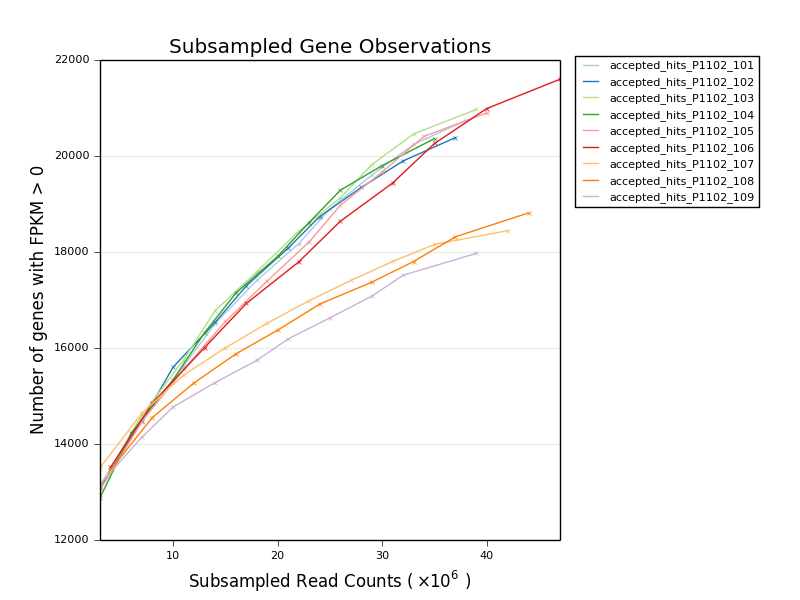
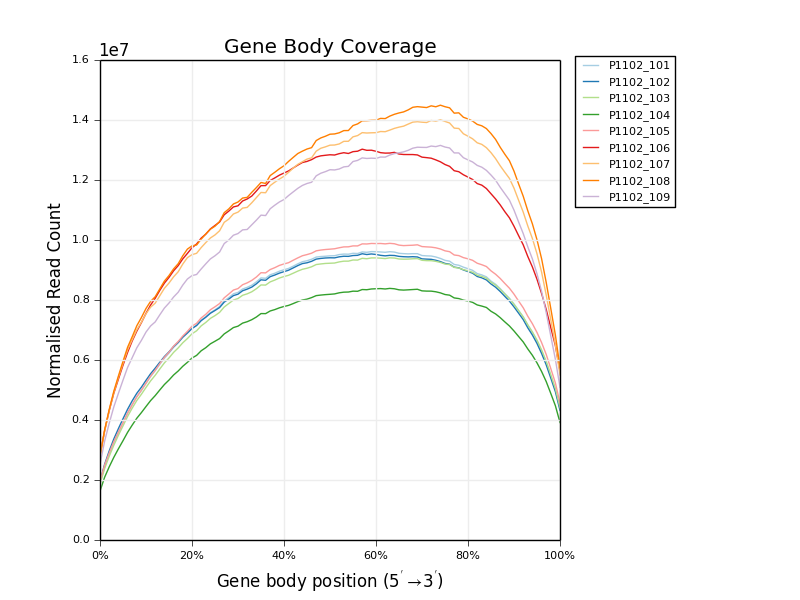
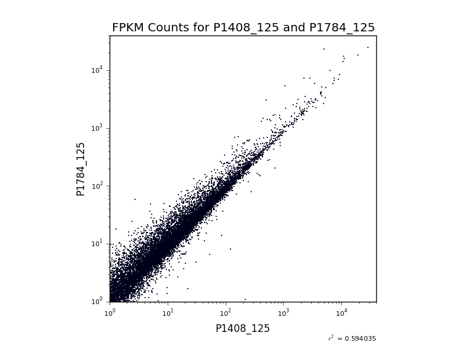
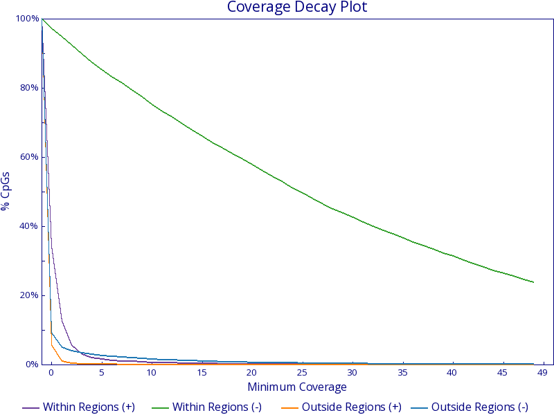
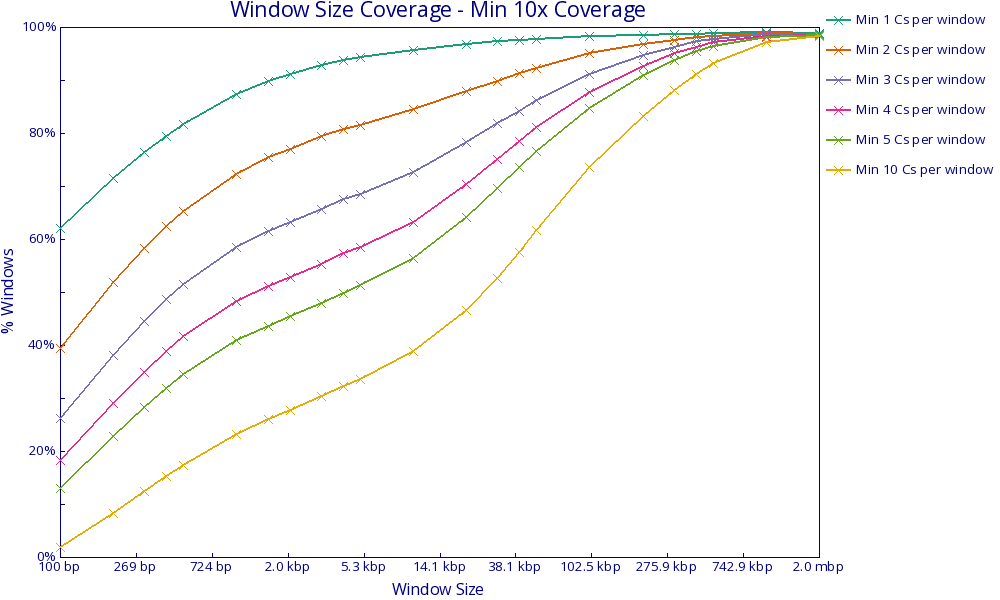

# NGI Visualizations

A collection of next-gen sequencing visualisation scripts. Click a script's
name to go to it's subdirectory which will contain a detailed `README.md`
file with examples and instructions.

---

> #### Depreciation notice
> Please Note that many of these scripts have been superseded by
> MultiQC (http://multiqc.info). if you're not familiar with it we
> recommend having a look there first before using the tools below.

---

### Introduction

Most of these scripts are written in Python. Those within the `stand_alone`
are generally run on the command line. The rest can either be run on the command
line or imported as part of the `ngi_visualizations` package. See
[below](#usage) for instructions on how to use the python package.

* [Count Biotypes](ngi_visualizations/count_biotypes/)
	* Uses HTSeq to plot read overlaps with different feature biotype flags
* [preseq Complexity Curves](ngi_visualizations/preseq_complexity_curves/)
* [Subsampled Gene Observations](stand_alone/subsampled_gene_observations/)
    * Group of scripts to plot the number of observed genes at varying sample
    subsampling proportions. Can give an impression of library complexity on
    a biological level.
* [Qualimap Plots](ngi_visualizations/qualimap/)
    * Scripts to generate Coverage and Insert Size histograms. Both of these
    plots are already produced by Qualimap. These just look nicer in our
    reports and have some extra plotting options.
* [snpEff Effect Type Plot](ngi_visualizations/snpEff/)
    * Script to create bar charts of SNP Effect counts, generated by snpEff.
* [Gene Body Coverage](ngi_visualizations/gene_body_coverage/)
* [Alignment Summaries](stand_alone/alignment_summaries/)
	* Two scripts to parse log files containing alignment stats from bowtie,
		bowtie 2 or tophat and generate overview HTML reports
* [Bismark Summary Report](stand_alone/bismark_summary/)
	* Script to parse lots of bismark output reports and generate a single HTML summary report.
* [Bismark Coverage Analysis](stand_alone/bismark_coverage/)
	* [Bismark Coverage Curves](stand_alone/bismark_coverage/#bismark-coverage-curves) - Plots the proportion of cytosines meeting increasing coverage thresholds
	* [Bismark Window Sizes](stand_alone/bismark_coverage/#bismark-window-sizes) - Plots the proportion of windows passing observation thresholds with increasing window sizes

## Examples
See below for example outputs. Click an image to go to that script.

<table>
  <tr>
    <th colspan="2"><a href="ngi_visualizations/count_biotypes/">Count Biotypes</a></th>
  </tr>
  <tr>
    <td width="50%">
      <a href="ngi_visualizations/count_biotypes/" title="Count Biotypes">
        
      </a>
    </td>
    <td>
      <a href="ngi_visualizations/count_biotypes/" title="Count Biotypes">
        
      </a>
    </td>
  </tr>
</table>

<table>
  <tr>
    <th><a href="ngi_visualizations/preseq_complexity_curves/">preseq Complexity Curves</a></th>
    <th><a href="stand_alone/subsampled_gene_observations/">Subsampled Gene Observations</a></th>
  </tr>
  <tr>
    <td width="50%">
      <a href="ngi_visualizations/preseq_complexity_curves/" title="preseq Complexity Curves">
        
      </a>
    </td>
    <td>
      <a href="stand_alone/subsampled_gene_observations/" title="Subsampled Gene Observations">
        
      </a>
    </td>
  </tr>
</table>

<table>
  <tr>
    <th colspan="2"><a href="ngi_visualizations/qualimap/">Qualimap Plots</a></th>
  </tr>
  <tr>
    <td width="50%">
      <a href="ngi_visualizations/qualimap/" title="Coverage Histogram">
        
      </a>
      <a href="ngi_visualizations/qualimap/" title="Insert Size Histogram">
        
      </a>
    </td>
    <td>
      <a href="ngi_visualizations/qualimap/" title="Genome Fraction Coverage">
        
      </a>
      <a href="ngi_visualizations/qualimap/" title="GC Distribution">
        
      </a>
    </td>
  </tr>
</table>
<table>
  <tr>
    <th colspan="2"> <a href="ngi_visualizations/snpEff/">snpEff Effect Plots</a></th>
  </tr>
    <td width="50%">
      <a href="ngi_visualizations/snpEff/" title="snpEff Effect Regions Plot">
        
      </a>
    </td>
    <td>
      <a href="ngi_visualizations/snpEff/" title="snpEff Effect Type Plot">
        
      </a>
    </td>
  </tr>
</table>

<table>
  <tr>
    <th><a href="ngi_visualizations/gene_body_coverage/">Gene Body Coverage</a></th>
    <th><a href="ngi_visualizations/fpkm_scatter/">FPKM Scatter Plot</a></th>
  </tr>
  <tr>
    <td width="50%">
      <a href="ngi_visualizations/gene_body_coverage/" title="Gene Body Coverage">
        
      </a>
    </td>
    <td>
      <a href="ngi_visualizations/fpkm_scatter/" title="FPKM Scatter Plot">
        
      </a>
    </td>
  </tr>
</table>
<table>
  <tr>
    <th><a href="stand_alone/alignment_summaries/">Alignment Summaries</a></th>
    <th><a href="stand_alone/bismark_summary/">Bismark Summaries</a></th>
  </tr>
  <tr>
    <td width="50%">
      <a href="stand_alone/alignment_summaries/" title="Alignment Summaries">
        
      </a>
    </td>
	<td>
      <a href="stand_alone/bismark_summary/" title="Bismark Summaries">
        
      </a>
    </td>
  </tr>
</table>

<table>
  <tr>
    <th><a href="stand_alone/bismark_coverage/#bismark-coverage-curves">Bismark Coverage Curves</a></th>
    <th><a href="stand_alone/bismark_coverage/#bismark-window-sizes">Bismark Window Sizes</a></th>
  </tr>
  <tr>
    <td width="50%">
      <a href="stand_alone/bismark_coverage/#bismark-coverage-curves" title="Bismark Coverage Curves">
        
      </a>
    </td>
    <td>
      <a href="stand_alone/bismark_coverage/#bismark-window-sizes" title="Bismark Window Sizes">
        
      </a>
    </td>
  </tr>
</table>

## Usage
For using stand alone packages see the `README.md` file in that package's subdirectory.

To use the `ngi_visulaizations` package, download or clone the repository.
Then, to install the package, run:

```
python setup.py install
```

If you intend to make any changes to the package, swap `install` for `develop`,
else you will have to reinstall the package each time you change the source code.

Once installed, you can import the script from the relevant subdirectory. For instance,
to use the [Qualimap Insert Size histogram](ngi_visualizations/qualimap/) you would use:

```python
from ngi_visulaizations.qualimap import insert_size
```

The functions within this script are then available in that namespace. For instance,
you could now generate the histograms by running:

```python
insert_size.plot_insert_size_histogram(input_fn)
```


## Contributing
If you would like to add a visualization script to this repository, please
read the [contributing notes](CONTRIBUTING.md) first. These describe the
steps required in adding your script to the repository.

## Credits
These scripts were written for use at the
[National Genomics Infrastructure](https://portal.scilifelab.se/genomics/)
at [SciLifeLab](http://www.scilifelab.se/) in Stockholm, Sweden.
For more information, please get in touch with
[Phil Ewels](https://github.com/ewels).

<p align="center"><a href="stand_alone/http://www.scilifelab.se/" target="_blank"></a></p>
