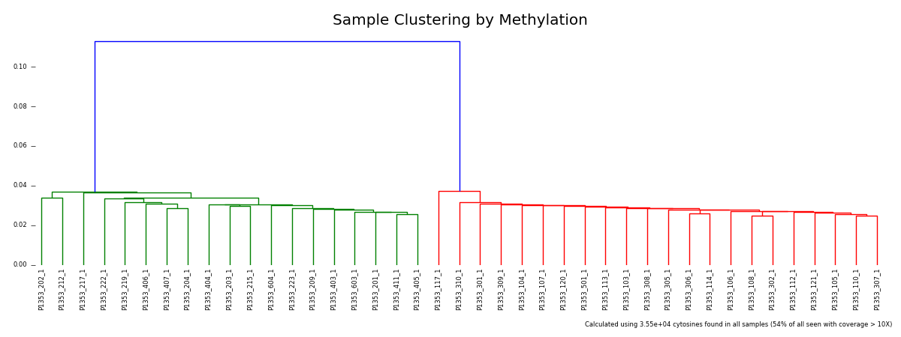

# Bismark ngi_visualizations toolkit

[Bismark](http://www.bioinformatics.babraham.ac.uk/projects/bismark/) is a tool
used for aligning Bisfulfite-Sequencing libraries, giving information about
DNA methylation.

This script reads in genome-wide coverage reports generated by Bismark (made
using the `coverage2cytosine` command) and calculates a number of metrics:

* Spearman's rank correlation coefficients between each sample
* Principal component analysis (PCA) eigenvectors / eigenvalues

It also generates a number of plots:

* Scatter plot for each sample pair
* Histogram of methylation percentages for each sample
* Heatmap of sample correlation scores
* Scatter plot of first two principal components
* Dendrogram of hierarchical clustering between samples

## Example Output

#### Clustering Dendrogram


## Usage

On the command line:
```bash
python bismark.py <sample_1.gwCov.cov> .. <sample_n.gwCov.cov>
```

Within a python script:

```python
from ngi_visualizations import bismark
bismark.run_comparisons(input_gwCov_file_paths)
```

## Dependencies

These scripts are written in Python and run on the command line. They require
output generated by [Bismark](http://www.bioinformatics.babraham.ac.uk/projects/bismark/).

The following Python libraries are required:

* [matplotlib](http://matplotlib.org/)
* [scipy](http://scipy.org/)
* argparse
* logging
* os

## Credits
These scripts were written for use at the
[National Genomics Infrastructure](https://portal.scilifelab.se/genomics/)
at [SciLifeLab](http://www.scilifelab.se/) in Stockholm, Sweden. They are
part of a larger repository of
[NGI Visualization Scripts](https://github.com/SciLifeLab/ngi_visualizations).

For more information, please get in touch with
[Phil Ewels](https://github.com/ewels).

<p align="center"><a href="http://www.scilifelab.se/" target="_blank"></a></p>
