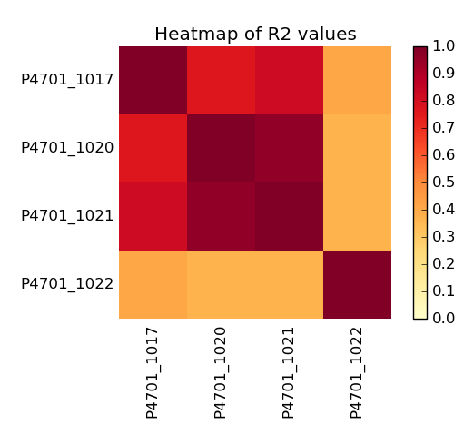

# FPKM Scatter Plots
FPKM (fragments per kilobase, per million) is a common metric in RNA-seq analysis to quantify expression. This script can use the output from either [Cufflinks](http://cole-trapnell-lab.github.io/cufflinks/) or [StringTie](https://ccb.jhu.edu/software/stringtie/). Or any other file in the same format; _first column being Ensemble ID, second column being gene name and the FPKM column having the header `FPKM` or being coumn number 10._ 

A simple and informative way to compare samples is to make a scatter plot of their
log(FPKM) scores and calculate a correlation score. 

## Example output



## Usage

This tool is a python script and should be run on the command line as follows:

```bash
python fpkm_scatter.py sample1.fpkm_tracking sample2.fpkm_tracking
```
or 

```bash
python fpkm_scatter.py *.txt 
```
The file name will be assumed to contain the sample name and will be truncated after the first dot (`.`) 

If you have FPKM summary files that looks like this:

```
ENSEMBL_ID	Gene_ID	Sample_1	Sample_2	Sample_3	Sample_4	...
ENSG00000000003	TSPAN6	0.1234	0.1234	0.1234	0.1234	...
```

then you can produce a scatter plot for each sample pair with the `--summary` option:

```bash
python fpkm_scatter.py --summary summary_1_fpkm.txt summary_2_fpkm.txt
```

If more than two samples were provided then a heatmap will be generated using the correlation scores (r2).
## Parameters

Arguments shown in order received by `plot_complexity_curves()`.

Command Line Flag | `plot_complexity_curves()` argument name | Description
----------------- | -------------------- | -----------
`<fpkm_files>` | `fns` | Required.<br>Paths to 2 or more FPKM files / or 2 summary files.
`-s`, `--summary` | `summary` Default: False<br>|Input files are summary FPKMs (see above)
`-o`, `--output-name` | `output_fn` | Default: `<sample1>_<sample2>`.<br>Output file name
`-l`, `--linear` | `linear` | Default: `False`.<br>Specify flag to use linear axes instead of log10
`-f`, `--heatmap` | `heatmap_fn` | Default: `heatmap`.<br>Heatmap file name
`-h`, `--help` | - | Display full help text.

## Dependencies

The script is written in Python. The following libraries are required:

* [matplotlib](http://matplotlib.org/)
* [numpy](http://www.numpy.org/)
* argparse
* logging
* os


## Credits
These scripts were written for use at the 
[National Genomics Infrastructure](https://portal.scilifelab.se/genomics/)
at [SciLifeLab](http://www.scilifelab.se/) in Stockholm, Sweden. They are 
part of a larger repository of
[NGI Visualization Scripts](https://github.com/SciLifeLab/ngi_visualizations).

For more information, please get in touch with
[Phil Ewels](https://github.com/ewels).

<p align="center"><a href="http://www.scilifelab.se/" target="_blank"></a></p>

