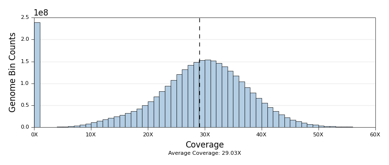
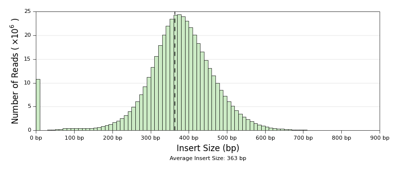
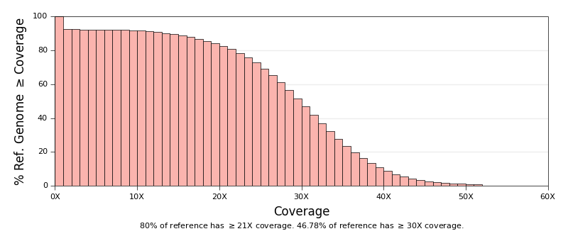
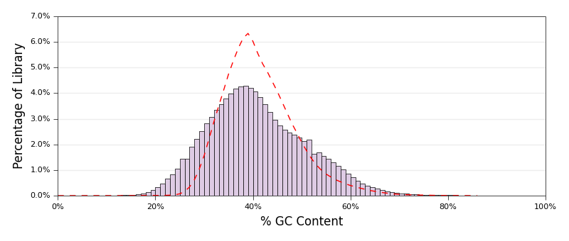
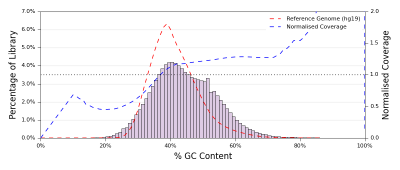

# Qualimap Plots

> **Please Note:** These scripts have been superseded by
> MultiQC (http://multiqc.info) - we recommend using that instead!

[Qualimap](http://qualimap.bioinfo.cipf.es/) is a tool to
_"facilitate the quality control of alignment sequencing data"_.

Whilst it produces nice plots out of the box, we have created some scripts
to re-plot some of the data to give a more consistent feel to the output.
We also split some of the plots up into per-chromosome graphs to give
a better view of the data.

## Coverage Histogram
Replacement plot for the Qualimap
[Coverage Histogram (0-50X)](http://kokonech.github.io/qualimap/HG00096.chr20_bamqc/images_qualimapReport/genome_coverage_0to50_histogram.png).
Essentially just stylistic changes - larger axis labels, different colours,
different aspect ratio and so on.

## Insert Size Histogram
Replacement plot for the Qualimap
[Insert Size Histogram](http://kokonech.github.io/qualimap/HG00096.chr20_bamqc/images_qualimapReport/genome_insert_size_histogram.png).

## Genome Fraction Coverage
Replacement plot for the Qualimap
[Genome Fraction Coverage Histogram](http://kokonech.github.io/qualimap/HG00096.chr20_bamqc/images_qualimapReport/genome_coverage_quotes.png).

## GC Distribution
Replacement plot for the Qualimap
[Mapped Reads GC-contentent Distribution Plot](http://kokonech.github.io/qualimap/HG00096.chr20_bamqc/images_qualimapReport/genome_gc_content_per_window.png).

### Picard - Normalised Coverage
This script can also plot the normalised coverage of each GC content bin
as generated by the Picard with the `CollectGcBiasMetrics` command.
The script is a bit busy, so we might not use it much, but the functionality
is there if you need it. Specify the Picard output file with the `--picard`
command line flag.

## Usage
These scripts work on the command line and take the raw Qualimap output as
inputs:

    coverage_histogram.py <coverage_histogram.txt>
    insert_size.py <insert_size_histogram.txt>
    genome_fraction_coverage.py <genome_fraction_coverage.txt>
    gc_distribution.py <mapped_reads_gc-content_distribution.txt>

All of these `.txt` files are generated
by [Qualimap](http://qualimap.bioinfo.cipf.es/) and can typically be found in
`raw_data_qualimapReport` report output folder.

## Parameters
Parameters are very similar, so shown in one table. Run the script with
`-h` to see more details, including default values.

| Command Line Flag    | Description |
| -------------------- | -------------------- |
| `<input>`            | Required. Qualimap output. See above. |
| `-o`, `--output`     | Default: _varies_ Plot output filename base. |
| `-x`, `--min_x`      | Default:  _varies_ Minimum x limit. `None` to use data limit. |
| `-m`, `--max_x`      | Default:  _varies_ Maximum x limit. `None` to use data limit or `Auto` to try to set intelligently (based on median / 50th | percentile).
| `-b`, `--bin_size`   | Default: `10` Bin size for histogram.  Insert Size Histogram only. |
| `-r`, `--ref_label`  | Default: `Reference Genome (hg19)` Legend for the reference data if present. GC distribution plot only. |
| `-p`, `--picard`     | Default: `None` Input file with results from `Picard CollectGcBiasMetrics` for optional coverage line. GC distribution plot only. |
| `-l`, `--log`        | Default: `info` Level of log messages to display. Can be `debug`, `info` or `warning`. |
| `-u`, `--log-output` | Default: `stdout` Log output filename. |
| `-h`, `--help`       | Display the help. |

## Dependencies

These scripts are written in Python and run on the command line. They require
output generated by [Qualimap](http://qualimap.bioinfo.cipf.es/).

The following Python libraries are required:

* [matplotlib](http://matplotlib.org/)
* argparse
* logging
* os

## Credits
These scripts were written for use at the
[National Genomics Infrastructure](https://portal.scilifelab.se/genomics/)
at [SciLifeLab](http://www.scilifelab.se/) in Stockholm, Sweden. They are
part of a larger repository of
[NGI Visualization Scripts](https://github.com/SciLifeLab/ngi_visualizations).

For more information, please get in touch with
[Phil Ewels](https://github.com/ewels).

