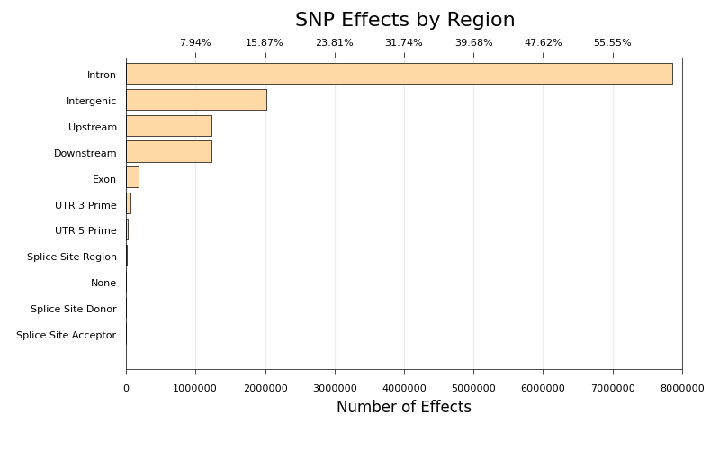
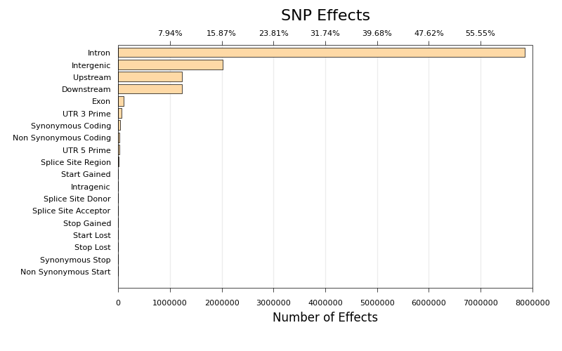

# snpEff Plots

> **Please Note:** This script has been superseded by
> MultiQC (http://multiqc.info) - we recommend using that instead!

[snpEff](http://snpeff.sourceforge.net/) is a tool which annotates genetic
variants in sequencing data and predicts their effect. The numbers
it produces are really nice, but at the time of writing the report
and plots are pretty ugly. Thankfully the tool can output the data in
`csv` format. This script takes that file and parses it, generating
some plots which are a little easier on the eyes..

## Example Output

## Usage
This plot takes the summarised `snpEff_summary.csv` output from
[snpEff](http://snpeff.sourceforge.net/):

    snpEff_plots.py snpEff_summary.csv

Two plots will be generated from the SNP effects - by type and by region.

## Parameters
Command Line Flag | Description
----------------- | -------------------- | -----------
`<input>` | Required. snpEff output. See above.
`-o`, `--output` | Default: `effect` Plot output filename base.
`-x`, `--logx` | Default: `False` Use a log x axis or not.
`-l`, `--log` | Default: `info` Level of log messages to display. Can be `debug`, `info` or `warning`.
`-u`, `--log-output` | Default: `stdout` Log output filename.
`-h`, `--help` | Display the help.

## Dependencies

This script is written in Python and is run on the command line. It requires
output generated by [snpEff](http://snpeff.sourceforge.net/).

The following Python libraries are required:

* [matplotlib](http://matplotlib.org/)
* argparse
* logging
* numpy
* os

## Credits
These scripts were written for use at the
[National Genomics Infrastructure](https://portal.scilifelab.se/genomics/)
at [SciLifeLab](http://www.scilifelab.se/) in Stockholm, Sweden. They are
part of a larger repository of
[NGI Visualization Scripts](https://github.com/SciLifeLab/ngi_visualizations).

For more information, please get in touch with
[Phil Ewels](https://github.com/ewels).

