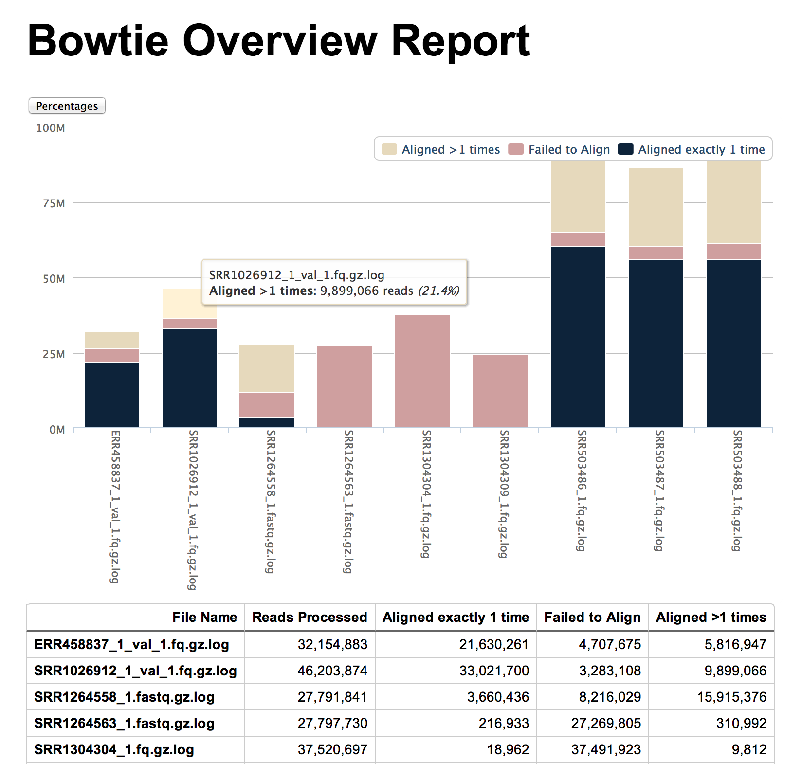

# Alignment Reports

> **Please Note:** These scripts have been superseded by
> MultiQC (http://multiqc.info) - we recommend using that instead!

[Bowtie](http://bowtie-bio.sourceforge.net/index.shtml),
[Bowtie 2](http://bowtie-bio.sourceforge.net/bowtie2/index.shtml) and
[Tophat](http://ccb.jhu.edu/software/tophat/index.shtml) are
commonly used next-gen sequencing read aligners.

It is quite usual to align many different input files in a batch. These
aligners generate statistics about how successful each alignment
is but these are usually held in text format, buried within a log file.
As such, failed alignments can be easy to miss and it is difficult to get
a quick overview as to the success of the batch.

These two Perl scripts simply search through a collection of log files
(one per alignment) and generate overview reports, showing a plot of
how many reads were aligned, how many were discarded due to multiple
mapping (if applicable) and how many failed to align. This plot can
be switched to display percentages instead of read counts.

The reports are generated in HTML with all assets embedded. As such they
can be shared as single files and viewed in any web browser.

## Usage

	bowtie_report.pl <*.log>
	tophat_report.pl <*.log>

## Example Output

See the example report here: [bowtie_report.html](https://rawgit.com/ewels/visualizations/master/examples/bowtie_report.html)

## Parameters

None. These scripts are quite basic. They generate a file in the current directory called `bowtie_report.html` or `tophat_report.html`, overwriting
any that exist with the same name.

**Note**: Each input log file must contain alignment stats for only one alignment.

## Dependencies

These scripts are written in Perl and run on the command line. They do not use
any additional Perl modules. The generated reports use
[jQuery](http://jquery.com/) (embedded) and
[HighCharts](http://www.highcharts.com/)
(embedded) to render the plots.

## Credits
These scripts were written for use at the
[National Genomics Infrastructure](https://portal.scilifelab.se/genomics/)
at [SciLifeLab](http://www.scilifelab.se/) in Stockholm, Sweden. They are
part of a larger repository of
[NGI Visualization Scripts](https://github.com/SciLifeLab/ngi_visualizations).

For more information, please get in touch with
[Phil Ewels](https://github.com/ewels).

